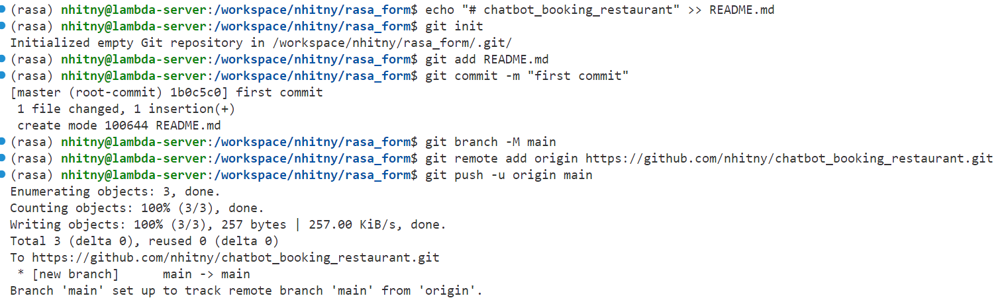

# chatbot_booking_restaurant
```
echo "# chatbot_booking_restaurant" >> README.md
 git init 
 git add README.md 
 git commit -m "first commit" 
 git branch -M main 
 git remote add origin https://github.com/nhitny/chatbot_booking_restaurant.git 
 git push -u origin main 
```

